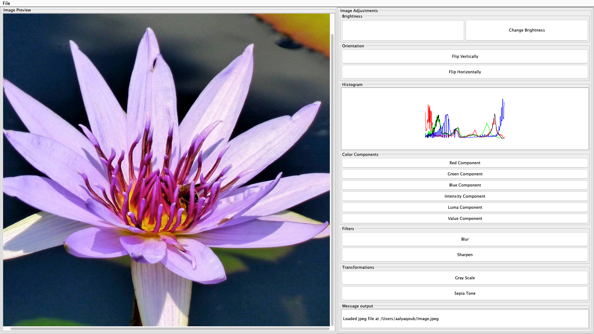
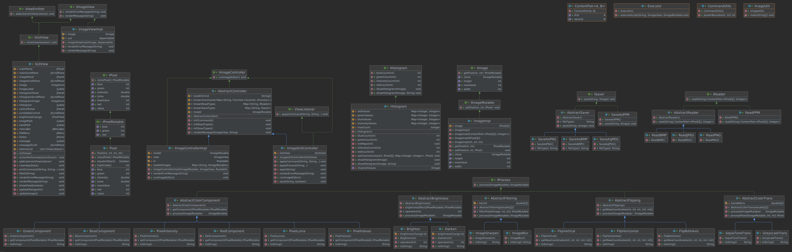

# Image Processing





## Project Info
The purpose of this project is to design a program that is capable of reading images and modifying
them in various ways. Some of the thought behind the design was to make it easy to expand to add
new features and functionality.

## Changees
We removed the constructor that allowed fo a reader Input because that gave the model IO 
functionality. We also abstracted brightening and darkening images further to remove duplicated 
code. Finally, we modified the access modifiers in our Brighten and Darken classes to make them 
private and final so that no one can access them and change them. Besides that we just added to 
functionality requested in the assignment. I created and implemented a new command object for 
partial and downsize. Then I added the commands to the controller.

## Image Model
### IIMage
This interface represents non-mutable operations that should be offered by an IImage implementation.
These operations will not change the Image.

### IImageMutable
This interface represents mutable operations that should be offered by an IImage implementation.
These operations will change the Image. This interface extends IIMage.

### ImageImpl
This class implements IImageMutable. This class allows for the representation of image files as a
2D array of pixels.

## Pixel Model
### IPixel
This interface represents operations that should be offered by an non-mutable pixels. These methods
will not change the the current pixel.

### IPixelMutable
This interface represents operations that should be offered by an mutable pixels. These methods
will change the the current pixel. This interface extends IPixel.

### Pixel
This class implements IPixelMutable. This class allows for the representation of an rgb pixel.

## Controller
### IImageController
This interface represents operations that should be offered by a controller for the IImage.

### ImageControllerImpl
This class implements IImageController. It allows for control and viewership of Image file and
IImage by using Readables and IImageView.

## Controller Commands
### IProcess
This interface represents operations that should be offered by processes that manipulate images in
certain ways.

### AbstractBrightness
This class is an abstract implementation of IProcess that allows for the modification of pixel
brightness.

### Brighten
This class extends AbstractBrightness and it allows for brightening images by increasing the value
of rgd of each pixel by the specified amount.

### Darken
This class extends AbstractBrightness and it allows darkening pixels by decreasing the value of rgd
by the specified amount.

### AbstractColorComponent
This class is an abstract implementation of IProcess that allows for the modification of pixel color
components.

### BlueComponent
This class extends AbstractColorComponent and it changes a pixel to its blue greyscale.

### GreenComponent
This class extends AbstractColorComponent and it changes a pixel to its green greyscale.

### RedComponent
This class extends AbstractColorComponent and it changes a pixel to its red greyscale.

### PixelValues
This class extends AbstractColorComponent and it changes a pixel to its value greyscale.

### PixelIntensity
This class extends AbstractColorComponent and it changes a pixel to its intensity greyscale.

### PixelLuma
This class extends AbstractColorComponent and it changes a pixel to its luma greyscale.

### AbstractFlipping
This class is an abstract implementation of IProcess that allows for the modification of pixel 
positioning.

### FlipBothAxis
This class extends AbstractFlipping and it allows for flipping an images along the vertical and 
horizontal axises by repositioning pixels.

### FlipHorizontal
This class extends AbstractFlipping and it allows for flipping an images along the horizontal axis
by repositioning pixels.

### FlipVertical
This class extends AbstractFlipping and it allows for flipping an images along the vertical axis
by repositioning pixels.

### AbstractFiltering
This class is an abstract implementation of IProcess that allows for the modification of pixels
based on surrounding pixels.

### ImageBlur
This class extends AbstractFiltering and applys Gaussian blur to images.

### imageSharpen
This class extends AbstractFiltering and applys Sharpening to image, accentuating the edges.

### AbstractColortrans
This class is an abstract implementation of IProcess that allows for the modification of pixels
based on its colors.

### GreyscaleTrans
This class extends AbstractColortrans and applys greyscale blur to images.

### SepiaToneTrans
This class extends AbstractColortrans and applys sepia tone to images.

### Mosaic
This command performs the mosaic operation on a given model.

### Downsizing
This command will shrink the image to the given new dimensions.

### Partial Process
This command applies another command to the black areas of a given mask.


### IReader
This interface represents operations that should be offered by an Readers to open and read Image 
files.

### ReadPPM
This class implements IReader and it allows for the opening and reading of PPM files.

### ContentPair<A, B>
A content pair is an object that can hold two different objects.

### ISaver
This interface represents operations that should be offered by an Savers to save IImages into
permanent files.

### SaveAsPPM
This class implements ISaver and it allows for the saving of images as PPM files.

## Image View
### IImageView
This interface represents operations that should be offered by a view for IImage.

### ImageViewImpl
This class implements IImageView and it allows for IImage related commands to to be viewed in a text
format and the rendering of other messages.

## Command Examples
To see an example of how the program runs enter the following commands for the desired outcome. 
Do not forget to uncompress the OGImage before you use it.
<br />This command will load the OGImage and refer to it as og
```java
load res/example/OGImage.ppm og
load {path} {refrence name} // General form
```

This command will brighten the og image and refer to the output as og-brighter
```java
brighten 100 og og-brighter
brighten {increment amount} {refrence name} {new reference name} // General form
```

This command will darken the og image and refer to the output as og-darker
```java
darken 100 og og-darker
darken {increment amount} {refrence name} {new reference name} // General form
```

This command will get the red-component greyscale of the og and refer to it as og-red
```java
red-component og og-red
red-component {refrence name} {new reference name} // General form
```

This command will get the green-component greyscale of the og and refer to it as og-green
```java
green-component og og-green
green-component {refrence name} {new reference name} // General form
```

This command will get the blue-component greyscale of the og and refer to it as og-blue
```java
blue-component og og-blue
blue-component {refrence name} {new reference name} // General form
```

This command will get the intensity-component greyscale of the og and refer to it as og-intensity
```java
intensity-component og og-intensity
intensity-component {refrence name} {new reference name} // General form
```

This command will get the luma-component greyscale of the og and refer to it as og-luma
```java
luma-component og og-luma
luma-component {refrence name} {new reference name} // General form
```

This command will get the values-component greyscale of the og and refer to it as og-values
```java
values-component og og-values
values-component {refrence name} {new reference name} // General form
```

This command will get the vertical-flip of the og-blue and refer to it as og-vertical
```java
vertical-flip og-blue og-vertical
values-component {refrence name} {new reference name} // General form
```

This command will get the horizontal-flip of the og-red and refer to it as og-horizontal
```java
horizontal-flip og-red og-horizontal
horizontal-flip {refrence name} {new reference name} // General form
```

This command will get both-flip of the og-green and refer to it as og-both-flip
```java
both-flip og-green og-both-flip
both-flip {refrence name} {new reference name} // General form
```

This command will save the files 
```java
save res/example/bright.ppm og-brighter
save res/example/dark.ppm og-darker
save res/example/red.ppm og-red
save res/example/green.ppm og-green
save res/example/blue.ppm og-blue
save res/example/intensity.ppm og-intensity
save res/example/luma.ppm og-luma
save res/example/values.ppm og-values
save res/example/vertical.ppm og-vertical
save res/example/horizontal.ppm og-horizontal
save res/example/both-flip.ppm og-both-flip
save {destination path} {reference name} // General form
```
In this case all saved files will be in the examples directory inside images. To exit program enter 
EOF command (command d on Macs). 

## Image Source
Amjad Al-Julaih @amjad715 instagram
